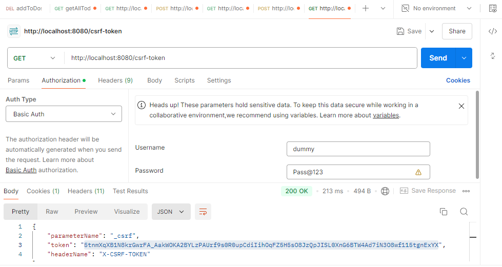
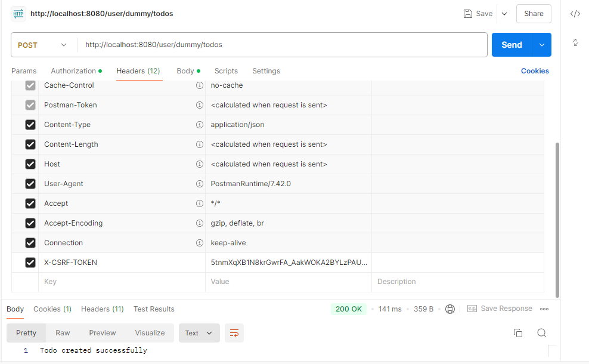

# CSRF in Rest API
- For GET request csrf token is not required but for POST/PUT/DELETE request CSRF token is required. For web based application with basic auth the csrf is already provided by default 
 but for rest based API we have to get the token first and then call POST/PUT/DELETE api.
```java
package com.amsidh.mvc.controller;

import jakarta.servlet.http.HttpServletRequest;
import org.springframework.security.web.csrf.CsrfToken;
import org.springframework.web.bind.annotation.GetMapping;
import org.springframework.web.bind.annotation.RestController;

@RestController
public class CsrfController {

    @GetMapping("/csrf-token")
    public CsrfToken getCsrfToken(HttpServletRequest httpServletRequest){
        return (CsrfToken) httpServletRequest.getAttribute("_csrf");
    }
}
```

[#img ]

- Use the above header and token value in POST/PUT/DELETE Request along with Basic authorization

[#img ]

- In addition to CSRF we also provide the below configuration for more security
````yaml
server:
  servlet:
    session:
      cookie:
        same-site: strict
````        

# For stateless API we have to disable the CSRF